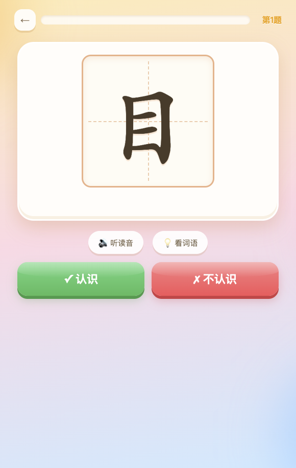
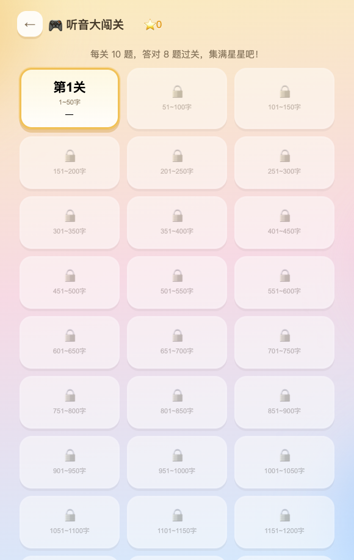
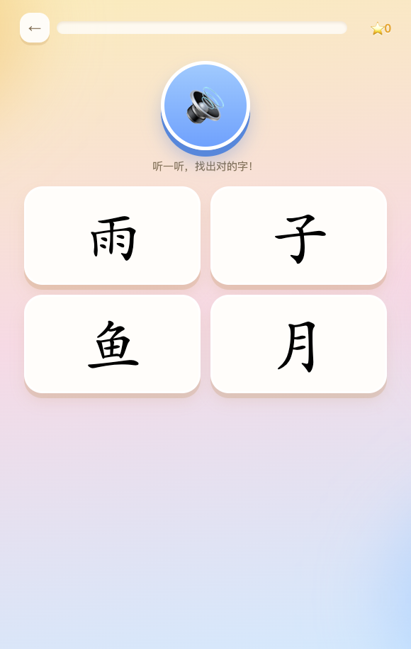

# 幼儿识字检测

基于「洪恩识字」字表（1795 字，按学习顺序）的儿童识字量小游戏。纯静态网页，无需联网、无需安装。

## 长这样

| 首页 | 测一测 | 选关卡 | 听音闯关 |
|---|---|---|---|
|  |  |  |  |

## 怎么玩

- **在线玩**：[https://urwateryi.github.io/shiziliang/](https://urwateryi.github.io/shiziliang/)
- **本地打开**：下载 [game/幼儿识字检测.html](game/幼儿识字检测.html)（单文件版，字库已内嵌），用任意浏览器打开即可。
- 也可以打开 `game/index.html`（需与 `game/hanzi-data.js` 在同一目录）。

## 两个模式

| 模式 | 玩法 | 适合 |
|---|---|---|
| 🎯 测一测识字量 | 孩子读字、家长判对错，分段抽样 + 边界自适应加测，几分钟估算识字量（含估算区间） | 家长陪同 |
| 🎮 听音大闯关 | 听发音选汉字，每关 10 题，闯关集星 | 孩子独立玩 |

## 目录说明

```
game/
  幼儿识字检测.html   单文件版（推荐分发）
  index.html          游戏页面
  hanzi-data.js       字库（字 + 词语 + 例句，1795 条）
tools/
  ocr_extract.py      从 PDF 提取字表（macOS Vision OCR）
  build_data.py       数据清洗，生成 hanzi-data.js
data/
  ocr_all.json        OCR 原始结果
```

## 关于字库

字库 OCR 自「洪恩识字」配套练字 PDF（1-200 / 201-600 / 601-1800 三册），每个字均用词语和例句交叉校验。
源 PDF 缺失原书第 321 页（第 1601~1605 字），故共 1795 字；348/349 两页在源文件中顺序颠倒，已修正。
